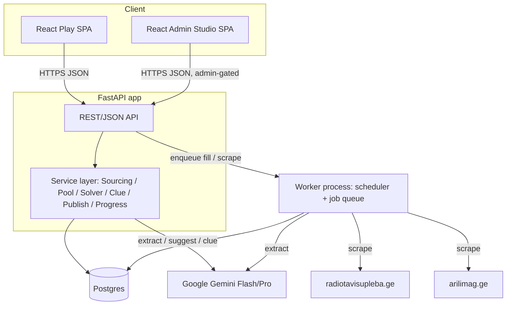

# TDD — Zigzagi: Georgian AI-Powered Crossword Game

| Field           | Value                                                              |
| --------------- | ----------------------------------------------------------------- |
| Tech Lead       | sandrogach@gmail.com                                               |
| Product Manager | sandrogach@gmail.com                                               |
| Team            | TBD (solo / small team)                                            |
| Source PRD      | `PRD.md` (Draft v0.1, 2026-06-18)                                  |
| Status          | Draft                                                              |
| Created         | 2026-06-18                                                         |
| Last Updated    | 2026-06-18                                                         |
| Project Size    | Large (> 1 month)                                                  |

> This TDD turns `PRD.md` into an implementable architecture. Where I think a PRD
> decision is risky or under-specified, I say so explicitly in **§6 — Architecture
> Decisions & Pushback on the PRD**. Read that section first if you only read one.

---

## 1. Context

**Background.** There is no NYT-quality daily crossword for Georgian. Hand-building
Georgian crosswords is slow, and no tooling turns fresh Georgian text into playable,
themed puzzles. Zigzagi is a web platform with two surfaces: an **Admin Studio**
(sourcing → word pool → deterministic grid fill → AI clues → schedule/publish) and a
**Play** view (one daily puzzle, NYT-app-like, calm animated background).

**Domain.** Content tooling + light AI pipeline + a daily-content delivery product.
Three distinct technical concerns live here: (1) a deterministic CSP solver, (2) an
AI extraction/clue pipeline over Gemini, and (3) a polished real-time solving UI.

**Stakeholders.** The constructor/admin (editorial speed + final control), anonymous
players (frictionless daily play), and signed-in players (cross-device streaks).
Secondary: legal/compliance for source scraping (RFE/RL content rights).

**Decisions locked for this TDD** (were TBD in the PRD):

- **Hosting/DB:** Managed Postgres (Neon/Supabase) + a container host (Fly.io/Render).
  Cloud-agnostic; AI stays a cross-cloud HTTPS dependency to Google.
- **Player auth:** Google OAuth only (no password storage).
- **Admin auth:** Single admin, simple gate (Google-restricted email).

---

## 2. Problem Statement & Motivation

### Problems we're solving

- **No modern Georgian crossword exists.** Impact: an entire language audience is
  unserved by the daily-crossword format that's a habit-forming staple elsewhere.
- **Hand-construction is too slow to sustain a *daily* puzzle.** Impact: without
  tooling, a daily cadence is impossible for a solo/small editorial team — the product
  cannot exist. Target: theme + pool → published puzzle in **≤ 15 min human time**.
- **No pipeline from living Georgian text → puzzle material.** Impact: puzzles would
  feel stale/academic instead of reflecting current language usage.

### Why now

- Gemini 2.5 (Flash/Pro) makes structured Georgian extraction and register-controlled
  clue writing cheap and good enough to keep a human purely in a review role.
- The hard part (grid fill) is solved with deterministic code + a curated wordlist —
  no model-reliability risk in the critical path.

### Impact of not solving

- **Product:** no daily content engine → no product.
- **Users:** the audience keeps having no native crossword.

---

## 3. Scope

### ✅ In Scope (v1.0 / MVP)

- Admin: paste-text ingestion (≥ 20k chars) + scraping of **radiotavisupleba.ge** and
  **arilimag.ge** (last 31 days).
- AI word **extraction** and **suggestion** (Gemini Flash), theme-conditioned, with
  backend alphabet/length re-validation.
- A curated **general Georgian fill wordlist** (tens of thousands of entries).
- **Deterministic CSP solver** (no AI): 13×13, 40–50 entries, 180° rotational
  symmetry, min length 3, **seeds-first** placement, unchecked cells allowed.
- AI **clue generation** (Gemini Pro), NYT-Monday register, per-entry
  accept/edit/reject logging.
- **Scheduling & publishing**: one live puzzle per date, runway warning (< 7 days).
- **Play** view: grid, clue bar + across/down lists, on-screen Georgian keyboard,
  check/reveal, timer, congrats, hazy animated background with reduced-motion fallback.
- **Anonymous play** (localStorage) + **optional Google sign-in** with progress merge
  and consecutive-day streak.

### ❌ Out of Scope (v1.0)

- AI anywhere in grid construction.
- Full NYT construction ruleset (complete interlock / no unchecked cells, themed long
  entries, rebus, circles), true 15×15, difficulty tiers.
- Multi-language support; social features (leaderboards, sharing, comments).
- Native mobile apps; payments/subscriptions; republishing full article bodies.

### 🔮 Future (v1.1 / v2.0)

- v1.1: Georgian lemmatizer, clue-quality dashboard, player archive browsing, richer
  stats, admin AI-accept analytics.
- v2.0: full interlock construction engine, true 15×15 Monday grids, more sources,
  difficulty tiers (Mon→Sat), sharing.

---

## 4. Technical Solution

### 4.1 Architecture Overview

A pragmatic **modular monolith**: one FastAPI app exposing the Play API and Admin API,
internal service modules, plus a **separate worker process** for the two background
jobs (daily scrape, daily publish) and for **solver fill runs** (which must not block
HTTP requests — see §6.2).



**Key components**

- **Sourcing service** — paste + scraping adapters; normalizes text, calls extraction.
- **Pool service** — `WordCandidate` lifecycle (offered → accepted/edited/rejected),
  dedupe, theme tagging.
- **Solver service** — pure-Python CSP fill; deterministic given inputs + seed; runs in
  the worker, results persisted.
- **Clue service** — batched Gemini Pro calls, structured output, accept/edit/reject log.
- **Publish service** — date scheduling, single-live-per-date invariant, runway calc.
- **Progress service** — anonymous + signed-in progress; merge-on-sign-in.
- **Worker** — APScheduler-style daily triggers + a DB-backed job table for fill/scrape.

### 4.2 Data Flow — Admin construction

1. Admin pastes text or triggers "Refresh sources" → Sourcing service.
2. Sourcing → Gemini Flash extraction (theme + existing pool as context) → candidate
   JSON → **backend re-validates** alphabet (U+10D0–U+10FF) + length 3–13 → `WordCandidate` rows.
3. Admin reviews/bulk-accepts → pool.
4. Admin sets theme, optional locks, clicks **Fill** → enqueues a solver job.
5. Worker runs deterministic fill → persists `Puzzle.grid_template` + `Entry` rows
   (each tagged `sourced` | `general-fill`) → admin polls job status.
6. Admin clicks **Generate clues** → Clue service batches entries → Gemini Pro →
   `Entry.clue` + `clue_status='generated'`.
7. Admin accept/edit/reject per clue (logged). Publish blocked until all accepted.
8. Admin schedules a date → `Puzzle.status='scheduled'`. Worker promotes to
   `published` on the live date (Asia/Tbilisi).

### 4.3 Data Flow — Player solving

1. Play SPA `GET /api/play/puzzles/today` → puzzle structure **without answers/clue
   solutions leaked** (grid shape, numbers, clues; answers never sent until reveal).
2. Local fills/timer/check-reveal state persist in `localStorage` keyed by date.
3. **Check/Reveal** call server endpoints that validate against stored answers (answers
   are never shipped wholesale to the client — see §9).
4. On Google sign-in, local progress for the current date merges into `Progress`.

### 4.4 API Contracts (indicative)

Admin endpoints are gated; Play endpoints are public (anonymous-friendly).

| Endpoint                                | Method | Surface | Purpose                                  |
| --------------------------------------- | ------ | ------- | ---------------------------------------- |
| `/api/admin/sources/refresh`            | POST   | Admin   | Enqueue scrape of both sources           |
| `/api/admin/extract`                    | POST   | Admin   | Extract candidates from pasted text      |
| `/api/admin/pool`                       | GET    | Admin   | List candidates (filter by status/theme) |
| `/api/admin/pool/bulk`                  | PATCH  | Admin   | Bulk accept/reject/edit                  |
| `/api/admin/suggest`                    | POST   | Admin   | Theme+pool word suggestions              |
| `/api/admin/puzzles`                    | POST   | Admin   | Create draft puzzle (theme, seed config) |
| `/api/admin/puzzles/{id}/fill`          | POST   | Admin   | Enqueue solver fill job                  |
| `/api/admin/jobs/{id}`                  | GET    | Admin   | Poll job status (fill/scrape)            |
| `/api/admin/puzzles/{id}/clues`         | POST   | Admin   | Batch-generate clues                     |
| `/api/admin/puzzles/{id}/clues/{eid}`   | PATCH  | Admin   | accept / edit / reject+regenerate        |
| `/api/admin/puzzles/{id}/schedule`      | POST   | Admin   | Schedule to a date                       |
| `/api/admin/dashboard/runway`           | GET    | Admin   | Days-of-runway remaining                 |
| `/api/play/puzzles/today`               | GET    | Play    | Today's puzzle (no answers)              |
| `/api/play/puzzles/{date}/check`        | POST   | Play    | Check square/word/puzzle                 |
| `/api/play/puzzles/{date}/reveal`       | POST   | Play    | Reveal square/word/puzzle                |
| `/api/play/progress`                    | PUT    | Play    | Upsert progress (signed-in)              |
| `/auth/google/*`                        | —      | Play    | Google OAuth flow                        |

**Example — extraction response (Gemini structured output, re-validated server-side):**

```json
{
  "dropped_count": 14,
  "candidates": [
    {
      "surface": "მთაწმინდაზე",
      "lemma": "მთაწმინდა",
      "length": 9,
      "snippet": "...ღონისძიება გაიმართა მთაწმინდაზე...",
      "source_url": "https://radiotavisupleba.ge/a/12345",
      "theme_relevance": 0.82
    }
  ]
}
```

**Example — today's puzzle for the Play view (answers withheld):**

```json
{
  "date": "2026-06-18",
  "theme": "თბილისი",
  "size": { "rows": 13, "cols": 13 },
  "blocks": [[0,0],[0,12],[6,6]],
  "cells": [{ "row": 0, "col": 1, "number": 1 }],
  "clues": {
    "across": [{ "number": 1, "cell": [0,1], "length": 5, "text": "..." }],
    "down":   [{ "number": 1, "cell": [0,1], "length": 4, "text": "..." }]
  }
}
```

### 4.5 Data Model (Postgres)

```mermaid
erDiagram
    WordCandidate ||--o{ Entry : "may seed"
    Puzzle ||--o{ Entry : contains
    Puzzle ||--o{ Progress : "tracked by"
    User ||--o{ Progress : has
    WordlistEntry }o--o{ Entry : "fills"

    WordCandidate { uuid id PK; text surface; text lemma; int length; text source_url; text snippet; text[] theme_tags; text status }
    Puzzle { uuid id PK; date live_date; text theme; jsonb grid_template; text status; bigint seed; int version }
    Entry { uuid id PK; uuid puzzle_id FK; int number; text direction; text answer; int row; int col; text clue; text clue_status; text provenance }
    WordlistEntry { uuid id PK; text word; int length; text status }
    User { uuid id PK; text google_sub; text email; timestamptz created_at }
    Progress { uuid id PK; text owner_key; uuid puzzle_id FK; jsonb fills; int timer_seconds; timestamptz completed_at }
```

Notes:
- `Puzzle.status` ∈ `draft | scheduled | published`. Partial unique index enforces
  **one `published`/`scheduled` puzzle per `live_date`**.
- `Progress.owner_key` = `user:{id}` or `anon:{client_id}` (uniform key for merge).
- `Entry.provenance` ∈ `sourced | general-fill`; `clue_status` ∈
  `pending | generated | accepted | edited | rejected`.
- `grid_template` stores the immutable black-square pattern + numbering; `Entry` rows
  carry answers and clues. Answers are **never** included in Play responses.

### 4.6 Algorithmic Solver (no AI)

**Stages, all deterministic given `(seeds, wordlist, template, seed_value)`:**

1. **Template selection** — pick a 13×13 black-square pattern with 180° symmetry,
   min length 3, 40–50 slots, from a **curated, pre-validated template library** (see
   §6.3) chosen pseudo-randomly by `seed_value`.
2. **Slot model** — build slots with crossing relationships; because unchecked cells
   are allowed (MVP), not every cell must cross — this materially lowers difficulty.
3. **Candidate indexing** — pre-index the wordlist by `(length, position, char)` for
   O(1) pattern lookup; seeds form a higher-priority candidate set.
4. **Seed placement** — place the required minimum (default ~15–20) seed words first,
   preferring longer/central slots (MRV ordering on the *remaining* slots).
5. **Fill** — backtracking with constraint propagation: most-constrained-slot first,
   forward-checking to prune dead branches; general wordlist fills remaining slots.
6. **Result** — persist filled grid + per-entry provenance, or a structured failure
   diagnostic (e.g., "not enough seed words of length 3–5").

**Guarantees:** deterministic + reproducible; time-bounded (default ≤ 10 s) with
graceful failure; seed-inclusion guarantee or explicit failure reason.

### 4.7 AI Task Contracts

| Task       | Model            | Input                                            | Output (JSON schema enforced)                       |
| ---------- | ---------------- | ------------------------------------------------ | --------------------------------------------------- |
| Extraction | Gemini 2.5 Flash | raw text + theme + existing pool                 | `[{surface, lemma, length, snippet, theme_relevance}]` |
| Suggestion | Gemini 2.5 Flash | theme + pool                                      | `[{word, reason, in_corpus}]`                        |
| Clue gen   | Gemini 2.5 Pro   | batched `[{entry_id, answer, direction, number, theme, source_snippet?}]` | `[{entry_id, clue}]` (Georgian, Monday register) |

- All calls use **structured-output / JSON-schema mode**; malformed → **one bounded
  retry** → surface error (never auto-publish on AI failure).
- Model per task is **config-driven** (env), re-pointable without code changes.
- AI output is **never trusted into the grid**: backend re-validates alphabet + length
  on extraction/suggestion before anything enters the pool.

### 4.8 Frontend

- React + TypeScript. **Reusable component library**: `<Grid>`, `<ClueBar>`,
  `<ClueList>`, `<GeorgianKeyboard>`, admin `<DataTable>`. Per global guidance, the
  solving engine (active cell, word, auto-advance, check/reveal state) is a **pure,
  framework-agnostic module** consumed by the React components, so it's unit-testable
  in isolation and reusable.
- **Background animation**: single WebGL fragment-shader layer (low contrast, slow),
  hard-disabled under `prefers-reduced-motion` and a settings toggle; CSS static
  gradient fallback if WebGL unavailable.
- **Persistence**: anonymous progress in `localStorage` keyed by date + a generated
  `client_id`; same shape as server `Progress.fills` for clean merge.

---

## 5. Risks

| Risk | Impact | Probability | Mitigation |
| --- | --- | --- | --- |
| **Pure-Python solver can't hit ≤10 s / 90%** under real constraints | High | Medium | Pattern-indexed CSP, run async in worker (not in request), curated template library, relaxed (unchecked) MVP grids; fall back to retry-with-new-seed/template. See §6.2. |
| Solver can't place required seed count | High | Medium | Seeds-first placement; tunable minimum; clear diagnostics; manual black-square edits; retry. |
| General fill wordlist quality (obscure/inflected/offensive) | High | Medium | Vet offline, score/tag, blocklist, admin reviews off-corpus entries pre-publish. **Sourcing + licensing is an open dependency (§15).** |
| Georgian morphology (inflected surface vs base form) | Medium | High | AI returns lemma+surface; admin reviews; lemmatizer in v1.1. |
| Scraping ToS / copyright (esp. RFE/RL) | High (legal) | Medium | Words-only extraction + attributed snippets, robots.txt + rate-limit, **pre-launch ToS review**, per-source kill switch. |
| Daily-puzzle treadmill (empty Play view) | High | High | Runway warning (<7 days), batch-build sessions, immutable backlog; automation later. |
| Clue accept rate < 80% | Medium | Medium | Pro model + strong Monday-register prompt + Georgian few-shot; track metric; iterate. |
| Background animation hurts perf/readability | Medium | Medium | ≥50 fps budget, low contrast, reduced-motion + toggle, CSS fallback. |
| Gemini latency/cost on batch clue gen | Medium | Medium | Batch, cache by (answer, theme), Flash for cheap tasks, progress UI. |
| Georgian mobile text input breaks solve loop | High | Medium | Custom on-screen keyboard; test iOS + Android early. |
| Answer leakage to client enables cheating/spoilers | Medium | Medium | Server-side check/reveal; never ship full answer set with the puzzle (§9). |

---

## 6. Architecture Decisions & Pushback on the PRD

The PRD is solid. Here is where I'd adjust, confirm, or push back — **these are the
parts worth deciding before building.**

### 6.1 ✅ Agree: deterministic solver, no AI in construction
Keeping AI out of the critical fill path is the right call — it removes
model-reliability risk from the one step that must always succeed. No change.

### 6.2 ⚠️ Push back: don't run the solver inside the HTTP request
The PRD frames the solver as a ≤10 s call. A 10 s **synchronous** HTTP request is
fragile on container hosts (Fly/Render request timeouts, proxy buffering) and gives a
poor admin UX if it ever runs long or fails. **Recommendation:** run fill as an async
job in the worker (DB-backed job row), admin polls `/api/admin/jobs/{id}`. This also
makes "regenerate with a new seed" and time-budget enforcement clean. Low cost, removes
a whole class of timeout failures. *(Reflected in §4.1/§4.6.)*

### 6.3 ⚠️ Push back: use a curated *template library*, not on-the-fly pattern generation
The PRD says "generate/select" a symmetric pattern. Generating valid, non-degenerate
13×13 symmetric patterns at runtime adds risk and nondeterminism. **Recommendation:**
ship a small **pre-validated library** of 13×13 symmetric templates (each already
checked for symmetry, min-length, slot count, connectivity) and have the solver pick
one by seed. Strictly more deterministic, easier to test, and removes a failure mode.

### 6.4 ⚠️ Flag, don't block: pure Python performance claim
The ≤10 s / ≥90% target is **plausible only because MVP allows unchecked cells** (fill
with slack is far easier than full interlock). With pattern indexing it should hold. But
PyPy/Rust/C-extension is *not* needed for MVP — I'd keep pure Python and **prove the
target with a load/representative-input test early** (Phase 2) rather than optimize
prematurely. The real cliff is **v2.0 full interlock**, which likely needs a different
engine — call that out now so v2.0 isn't scoped as a small delta.

### 6.5 ✅ Confirm with caveat: modular monolith over microservices
The PRD's single FastAPI + services + jobs is right for MVP — don't split into
services. My only addition: make the **worker a separate process** (not threads inside
the web app) so a long scrape/fill can't degrade Play latency.

### 6.6 ⚠️ Add: answers must not ship to the client
The PRD doesn't state this explicitly. For a daily puzzle, shipping the full answer
grid to the browser invites trivial cheating and spoiler leaks. **Recommendation:**
Play API returns structure + clues only; **check/reveal are server-side** endpoints.
This slightly increases API chatter but is the correct integrity boundary.

### 6.7 ✅ Agree with locked decisions
Managed Postgres + container host, Google-OAuth-only players, single-admin gate — all
appropriate for MVP scale and minimize PII and ops. No change.

### 6.8 ℹ️ Note: wordlist is the critical-path dependency, not the AI
The biggest *unknown* isn't the models — it's sourcing a licensed, clean, tens-of-
thousands-entry general Georgian wordlist. If that slips, the solver can't fill and the
product can't ship. I'd treat wordlist acquisition as a **Phase 0 blocker**, parallel
to setup, not a mid-project task. *(See §15.)*

---

## 7. Implementation Plan

| Phase | Task | Owner | Est. |
| --- | --- | --- | --- |
| **0 — Foundations** | Provision Postgres + container host + CI; FastAPI skeleton; Google OAuth + admin gate | Dev | 3 d |
| | **Acquire + vet general Georgian wordlist** (blocker) | Dev | 3–5 d |
| **1 — Sourcing & pool** | Paste ingestion; alphabet/length validator; Gemini Flash extraction; pool review UI | Dev | 5 d |
| | Scrapers (2 sites, 31-day window, robots/rate-limit) + worker schedule | Dev | 4 d |
| | AI word suggestions | Dev | 2 d |
| **2 — Solver** | Template library; pattern-indexed CSP fill; seeds-first; async job + polling; determinism + perf tests | Dev | 7 d |
| **3 — Clues** | Batched Gemini Pro clue gen; accept/edit/reject + logging; publish-gate | Dev | 4 d |
| **4 — Publishing** | Scheduling, one-per-date invariant, runway dashboard, daily-publish worker | Dev | 3 d |
| **5 — Play view** | Grid/clue/keyboard component library + engine module; check/reveal; timer; localStorage; congrats | Dev | 8 d |
| | WebGL hazy background + reduced-motion/fallback | Dev | 2 d |
| | Google sign-in + progress merge + streak | Dev | 3 d |
| **6 — Hardening** | Eval harness (extraction gold set, clue benchmark); monitoring; mobile input testing; deploy | Dev | 5 d |

**Critical path:** Phase 0 (wordlist) → Phase 2 (solver) → Phase 5 (Play). Sourcing
(Phase 1) and clues (Phase 3) can overlap. Rough total ≈ 8–9 weeks solo.

---

## 8. Security & Privacy

- **Admin auth:** single admin, Google sign-in restricted to an allowlisted email;
  all `/api/admin/*` routes require it.
- **Player auth:** Google OAuth only — store `google_sub` + email, no passwords.
  Anonymous default keyed by client-generated `client_id` in `localStorage`.
- **Secrets:** Gemini API key + DB creds + OAuth secrets server-side only, via host
  secret manager / env; never shipped to the client; all AI calls proxied by backend.
- **Scraping:** restricted to the two whitelisted domains, robots.txt honored, rate-
  limited; store only extracted words + short attributed snippets + source URL — **not**
  full article bodies; per-source kill switch; pre-launch ToS/copyright review (RFE/RL).
- **Answer integrity:** answers never sent to the Play client; check/reveal validated
  server-side.
- **PII:** minimal — optional account email + Google sub only; public byline attribution
  only, no article-author personal data.
- **Standard hygiene:** input validation on all endpoints, parameterized queries,
  rate-limiting on public Play + auth endpoints, audit log of admin publish actions.

---

## 9. Testing Strategy

| Type | Scope | Target |
| --- | --- | --- |
| Unit | Solver (symmetry, min-length, crossing consistency, seed-inclusion, reproducibility); frontend engine module; validators | High coverage on solver + engine |
| Property/Deterministic | Same inputs+seed → identical grid; fill success rate on representative seed sets | ≥ 90% fill in ≤ 10 s |
| Integration | Admin pipeline (extract→pool→fill→clue→publish); Play API (today/check/reveal/progress) | Critical paths |
| AI evals | Extraction: 10-article gold set — **Precision@all ≥ 0.7**, **filter accuracy = 100%**. Clue: 50 (answer, theme) benchmark, regression on prompt change; track prod accept-or-minor-edit ≥ 80% | KPI #3 |
| E2E | Full solve loop desktop + mobile (iOS/Android), Georgian keyboard, check/reveal, congrats, reduced-motion | Zero blocking bugs |
| Perf | Play interactive ≤ 2.0 s mid-range mobile; background ≥ 50 fps | Success criteria #4 |

The solver is validated by **deterministic tests, not model evals** (per PRD §3.3).

---

## 10. Monitoring & Observability

| Metric | Threshold / Alert |
| --- | --- |
| `solver.fill_duration` / `solver.success_rate` | p95 > 10 s or success < 90% → investigate |
| `gemini.latency` / `gemini.error_rate` | error spike or p95 high → alert; never auto-publish on failure |
| `clue.accept_rate` (accept-or-minor-edit) | < 80% trailing → prompt review |
| `publish.runway_days` | **< 7 days → admin warning** (also a product feature) |
| `scrape.success` per source | one source failing must not block the other; alert on both failing |
| `play.api_latency` / `play.error_rate` | p95 > 1 s / >1% → investigate |
| `play.tti` / `bg.fps` (RUM) | TTI > 2 s or fps < 50 → investigate |

Structured JSON logging for all API + AI + scrape + fill calls; **never log secrets or
full article bodies.** Log admin publish/unpublish as audit events.

---

## 11. Rollback Plan

- **Deploy:** container image rollback to previous tag on the host; DB migrations are
  reversible (down migrations), snapshot before any schema change.
- **Feature gating:** the WebGL background, scraping per source, and (optionally) new
  Play features sit behind config flags so they can be disabled without redeploy.
- **Rollback triggers:** Play error rate > 5% (5 min) → roll back image; solver success
  < 50% after a change → revert solver; a source's scrape misbehaving → kill that
  source via flag; migration failure → stop, do not proceed.
- **Content safety net:** because a bad deploy could disrupt the *daily* puzzle, keep
  the runway ≥ 7 published puzzles so a rollback never produces an empty Play view.
- **Post-rollback:** root-cause within 24 h, fix + re-test, re-deploy.

---

## 12. Success Metrics

Directly from PRD §1 (acceptance):

| Metric | Target |
| --- | --- |
| Theme+pool → published puzzle | ≤ 15 min human time |
| Solver valid symmetric fill | ≥ 90% of attempts in ≤ 10 s, all required seeds placed |
| Clue accept-or-minor-edit rate | ≥ 80% |
| Play interactive on mid-range mobile | ≤ 2.0 s; background ≥ 50 fps; reduced-motion auto-disable |
| Core solve loop | Zero blocking bugs, mobile + desktop |

---

## 13. Alternatives Considered

| Decision | Chosen | Alternatives & why not |
| --- | --- | --- |
| Solver execution | Async worker job + polling | Synchronous ≤10 s HTTP — fragile timeouts (§6.2) |
| Grid pattern source | Curated template library | Runtime generation — nondeterministic, more failure modes (§6.3) |
| Solver language | Pure Python (MVP) | Rust/C-extension — premature; only likely needed for v2.0 interlock (§6.4) |
| Service topology | Modular monolith + worker | Microservices — overkill for MVP scale (§6.5) |
| Answer delivery | Server-side check/reveal | Ship answers to client — cheating/spoilers (§6.6) |
| Hosting/DB | Managed Postgres + container host | GCP/AWS native — heavier ops for MVP; chosen for speed/portability |
| Player auth | Google OAuth only | Email/password — password infra + more PII for no MVP benefit |

---

## 14. Dependencies

| Dependency | Type | Status | Risk |
| --- | --- | --- | --- |
| Google Gemini 2.5 Flash/Pro | External AI | Available | Latency/cost — mitigated by batching/cache |
| **General Georgian fill wordlist** | Data | **Not sourced (Phase 0 blocker)** | **High — gates the whole solver (§6.8)** |
| radiotavisupleba.ge / arilimag.ge | External content | Needs ToS review | Legal — words-only + kill switch |
| Managed Postgres (Neon/Supabase) | Infra | To provision | Low |
| Container host (Fly/Render) | Infra | To provision | Low |
| Google OAuth | External auth | Available | Low |

---

## 15. Open Questions

| # | Question | Owner | Status |
| --- | --- | --- | --- |
| 1 | Source + license of the general Georgian fill wordlist (open dataset vs self-built)? | Admin | 🔴 Open — **blocks Phase 2** |
| 2 | Final minimum seed-word count per puzzle (default ~15–20)? | Admin | 🟡 Tune after first fills |
| 3 | Daily-publish timezone — confirm **Asia/Tbilisi**? | Admin | 🟡 Assumed |
| 4 | RFE/RL (radiotavisupleba) content-rights sign-off before launch? | Legal/Admin | 🔴 Open |
| 5 | Approve §6.2 (async solver) and §6.3 (template library) recommendations? | Tech Lead | 🔴 Open |

---

## 16. Glossary

| Term | Meaning |
| --- | --- |
| Seed word | A sourced/manual pool word the solver must place (≥ configured minimum). |
| General fill wordlist | Curated vetted Georgian wordlist used to fill non-seed slots. |
| Unchecked cell | A cell not crossed by both an across and a down entry (allowed in MVP only). |
| Provenance | Per-entry tag: `sourced` vs `general-fill`. |
| Runway | Number of consecutive future days with a scheduled/published puzzle. |
| Monday register | NYT-Monday clue style: straightforward, definitional, minimal wordplay. |
| Lemma | Dictionary/base form of an inflected Georgian surface word. |
