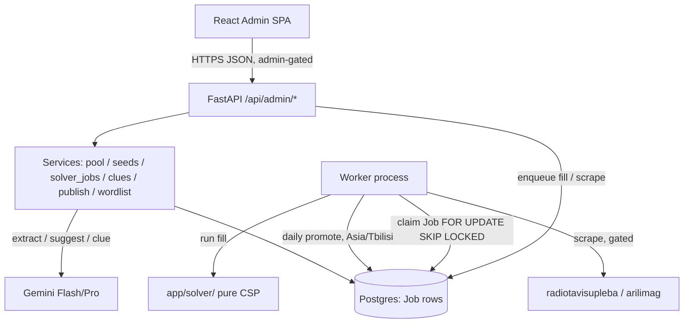

# TDD — Zigzagi Admin Panel

| Field | Value |
| --- | --- |
| Tech Lead | sandrogach@gmail.com |
| Product Manager | sandrogach@gmail.com |
| Team | Solo / small team |
| Source PRD | `docs/ADMIN_PRD.md`, `PRD.md` |
| Parent TDD | `DESIGN.md` (full-system) |
| Plans | `docs/superpowers/plans/` (solver, sourcing-pool, clues, publishing) |
| Status | Draft v0.1 |
| Created | 2026-06-19 |
| Project Size | Large (admin slice of a > 1 month build) |

> Scope: the **Admin Studio** only — construct a crossword and curate words. The Play view, player
> auth, and the solver internals are covered by `DESIGN.md` and their own plans; this doc references
> them rather than re-deriving them. Where a thing is already built, the **Status** column says so.

---

## 1. Context

**Background.** Zigzagi needs a daily Georgian crossword. The Admin Studio is the content engine:
it turns Georgian text into a vetted word pool, deterministically fills a symmetric grid from that
pool plus a shared wordlist, generates clues with Gemini, and schedules one puzzle per day. The
backend is a FastAPI modular monolith with a separate worker process; the frontend is a React/TS SPA.
Sourcing/pool and solver-fill are already implemented; clues, scheduling, and the global wordlist
curation surface are not yet built.

**Domain.** Content tooling + a light AI pipeline (extraction, suggestion, clue writing over Gemini)
+ a deterministic CSP solver. The admin is a single trusted user.

**Stakeholders.** The constructor/admin (editorial speed + final control). Secondary: legal
(scraping rights, gated separately), and the Play surface as the downstream consumer of published
puzzles.

---

## 2. Problem Statement & Motivation

### Problems we're solving

- **Hand-building a daily Georgian crossword is too slow.** Without tooling a daily cadence is
  impossible for one editor. Target: theme + reviewed pool → published puzzle in **≤ 15 min** human time.
- **No single place to curate Georgian word material.** Two needs coexist and are conflated today:
  per-puzzle themed seed words (sourced/extracted) and a reusable general-fill wordlist. The admin
  has no surface for the latter, so the solver has nothing dependable to complete grids with.
- **No construction pipeline UI.** Fill/clue/schedule exist (or are planned) as endpoints with no
  cohesive admin flow tying them together.

### Why now

Sourcing and the deterministic solver already work end-to-end at the service layer; the missing
pieces (global wordlist CRUD, clue review, scheduling, and an admin shell that sequences them) are
what unblock shipping real puzzles.

### Impact of not solving

No daily content engine → no product. A thin or unmanaged fill wordlist → the solver can't complete
grids → the pipeline stalls regardless of how good extraction is.

---

## 3. Scope

### ✅ In Scope

- **Global fill-wordlist curation** (new): list/search/filter, add, edit, block/unblock, bulk
  import of `WordlistEntry`, with per-length coverage counts.
- **Per-puzzle themed-candidate configuration**: create a draft puzzle with a theme; build its seed
  pool via paste→extract, suggest, and (gated) scrape; bulk accept/edit/reject; set min-seed count;
  lock words.
- **Deterministic async fill**: enqueue a fill job, poll status, see provenance, regenerate with a
  new seed, read structured failure reasons.
- **Clue generation & review**: batch-generate (Gemini Pro), accept/edit/reject+regenerate per
  entry with an audit log; publish gate requiring all clues accepted.
- **Schedule & publish**: schedule to a date (one-per-date, 409 on conflict), runway dashboard with
  a < 7-day warning, worker auto-promote on the live date (Asia/Tbilisi).
- **Admin shell**: an authenticated SPA that sequences the above; reuses `<DataTable>`.

### ❌ Out of Scope

- Play view, player auth/progress/streaks (`DESIGN.md`, Play plans).
- Solver algorithm changes (the CSP is built and frozen for MVP).
- Real scraper adapters going live (built behind a kill switch; **gated on RFE/RL ToS sign-off**).
- AI anywhere in grid construction; multi-admin roles; clue-quality analytics dashboard.

### 🔮 Future (v1.1+)

Georgian lemmatizer; clue-quality/accept-rate dashboard; wordlist scoring/tags beyond active|blocked;
full-interlock construction (v2.0).

---

## 4. Technical Solution

### 4.1 Architecture Overview

Modular monolith (FastAPI) + a separate worker process. The admin SPA talks only to gated
`/api/admin/*` endpoints; long-running work (fill, scrape) is enqueued as DB-backed `Job` rows and
processed by the worker; HTTP only enqueues and polls. The solver package is pure (no FastAPI/DB
imports); `services/solver_jobs.py` is the sole bridge between solver output and the DB.



**Key components & responsibilities**

- **Pool service** (`services/pool.py`) — `WordCandidate` lifecycle: create-from-extraction
  (re-validates + dedupes), list, bulk accept/edit/reject. *Built.*
- **Seeds provider** (`services/seeds_provider.py`) — accepted/edited surfaces for a puzzle's theme,
  injected into the worker as the solver's seed source. *Built.*
- **Solver jobs** (`services/solver_jobs.py`) — `enqueue_fill`, `run_fill_job`, `persist_fill`
  (writes `Entry` rows + `grid_template`). *Built.*
- **Wordlist service** (`services/wordlist.py`) — global `WordlistEntry` CRUD + bulk import with
  re-validation/dedupe + per-length counts. *New.*
- **Clue service** (`services/clues.py`) — batch generate, review (accept/edit/reject+regenerate),
  accept-rate; writes `ClueEvent` audit rows. *Planned.*
- **Publish service** (`services/publish.py`) — `schedule_puzzle`, `promote_due_puzzles`,
  `can_publish` gate, `runway_days`. *Partly built; `can_publish`/`runway_days` planned.*
- **Worker** (`worker.py`) — claims fill jobs, loads the active wordlist, runs fill; daily
  promote tick. *Fill loop built; promote tick planned.*

### 4.2 Two word stores (the model decision)

| Store | Scope | Role | Status field | Surface |
| --- | --- | --- | --- | --- |
| `WordlistEntry` | **Global**, shared by every fill | General-fill slots | `active \| blocked` | Global curation screen (new) |
| `WordCandidate` | **Per puzzle**, by theme | Required solver **seeds** | `offered \| accepted \| edited \| rejected` | Pool review screen (built) |

Decision: **keep both stores; do not merge.** The PRD considered one unified pool and rejected it —
seeds and fill have different lifecycles (per-puzzle review vs. curate-once) and different solver
roles (must-place vs. may-place). The new work is additive: a curation surface for the global list,
and per-puzzle wiring of accepted candidates into a fill.

> Open decision (§9 Q1): candidate→puzzle association. Today `seeds_for_puzzle` matches
> `WordCandidate.theme_tags` against `Puzzle.theme` (no FK). "Configure candidates per puzzle" can
> stay theme-based (candidates reusable across puzzles sharing a theme) or move to an explicit
> `puzzle_id` (candidates owned by one puzzle). This changes the model and the UI; decide before
> building puzzle-create.

### 4.3 Data Flow — admin construction

1. **Curate global wordlist** (independent, ongoing): add/import/block `WordlistEntry`s. Only
   `active` entries are loaded by the worker for fill.
2. **Create puzzle** with a theme (`draft`).
3. **Build seed pool**: paste text → `POST /extract` (Gemini Flash → re-validate alphabet+length →
   `WordCandidate` `offered`); `POST /suggest`; (scrape, gated). Bulk accept/edit via `/pool/bulk`.
4. **Fill**: `POST /puzzles/{id}/fill` enqueues a `Job(kind=fill)`. Worker claims it, resolves seeds
   via `seeds_for_puzzle`, loads active wordlist, runs the pure solver, `persist_fill` writes
   `Entry` rows (`provenance ∈ sourced|general-fill`) + `grid_template`, or the job is `failed` with
   a reason. Admin polls `GET /jobs/{id}`.
5. **Clues**: `POST /puzzles/{id}/clues` batches Gemini Pro → `Entry.clue`, `clue_status=generated`.
   Admin `PATCH .../clues/{eid}` accept/edit/reject(+regenerate); each logged as `ClueEvent`.
6. **Schedule**: `POST /puzzles/{id}/schedule` — `can_publish` gate (422 if clues unfinished),
   partial unique index (409 on date conflict) → `status=scheduled`. Worker promotes to `published`
   on the live date.

### 4.4 API Contracts (admin; all under `/api/admin`, all gated)

| Endpoint | Method | Purpose | Status |
| --- | --- | --- | --- |
| `/wordlist` | GET | List global fill entries (filter `status`,`length`; search) | New |
| `/wordlist` | POST | Add one entry (re-validated) | New |
| `/wordlist/{id}` | PATCH | Edit / block / unblock | New |
| `/wordlist/bulk` | POST | Bulk import: validate, dedupe, `{added, rejected:[{word,reason}]}` | New |
| `/wordlist/stats` | GET | Active/blocked totals + per-length histogram | New |
| `/extract` | POST | `{text, theme}` → `{dropped_count, candidates}` | Built |
| `/pool` | GET | List candidates (`status`, `theme`) | Built |
| `/pool/bulk` | PATCH | Bulk accept/reject/edit | Built |
| `/suggest` | POST | `{theme}` → suggestions | Built |
| `/sources/refresh` | POST | Enqueue scrape | Deferred (ToS gate) |
| `/puzzles` | POST | Create draft (theme, min-seed, seed config) | New |
| `/puzzles/{id}/fill` | POST | Enqueue fill job → `202 {job_id}` | Built |
| `/jobs/{id}` | GET | Poll `{status, result?, error?}` | Built |
| `/puzzles/{id}/clues` | POST | Batch-generate → `{generated}` | Planned |
| `/puzzles/{id}/clues/{eid}` | PATCH | `{action, clue?}` → `{clue_status}` | Planned |
| `/puzzles/{id}/schedule` | POST | `{live_date}` → 200/409/422 | Planned |
| `/dashboard/runway` | GET | `{runway_days, warning}` | Planned |

**Example — fill failure surfaced via job poll:**

```json
{ "status": "failed", "result": null,
  "error": "no seed word of length 9 for slot 12" }
```

**Example — bulk wordlist import response:**

```json
{ "added": 812,
  "rejected": [ { "word": "abc", "reason": "non-georgian" },
                { "word": "აბ", "reason": "length<3" } ] }
```

### 4.5 Data Model (admin-relevant; current state)

```mermaid
erDiagram
    Puzzle ||--o{ Entry : contains
    WordCandidate }o--o{ Entry : "may seed (by theme)"
    WordlistEntry }o--o{ Entry : "fills"
    Entry ||--o{ ClueEvent : "audited by"
    Job }o--|| Puzzle : "fills"

    Puzzle { uuid id PK; date live_date; text theme; jsonb grid_template; text status; bigint seed; int version }
    Entry { uuid id PK; uuid puzzle_id FK; int number; text direction; text answer; int row; int col; text clue; text clue_status; text provenance }
    WordCandidate { uuid id PK; text surface UK; text lemma; int length; text source_url; text snippet; text[] theme_tags; text status }
    WordlistEntry { uuid id PK; text word UK; int length; text status }
    Job { uuid id PK; text kind; uuid puzzle_id; text status; jsonb params; jsonb result; text error; timestamptz created_at }
    ClueEvent { uuid id PK; uuid entry_id FK; text action; text old_clue; text new_clue; timestamptz created_at }
```

- `Puzzle.status ∈ draft|scheduled|published`; partial unique index → one `scheduled|published`
  per `live_date`.
- `Entry.provenance ∈ sourced|general-fill`; `clue_status ∈ pending|generated|accepted|edited|rejected`.
- `ClueEvent` is **planned** (Clues plan Task 2). Built today: `Puzzle, Entry, WordlistEntry,
  WordCandidate, Job`.
- Answers live on `Entry`; they are **never** included in any Play response (integrity boundary —
  admin-only).

### 4.6 AI task contracts

| Task | Model (config-driven) | Output (JSON-schema enforced) |
| --- | --- | --- |
| Extraction | `GEMINI_EXTRACT_MODEL` (Flash) | `[{surface, lemma, length, snippet, theme_relevance}]` |
| Suggestion | `GEMINI_SUGGEST_MODEL` (Flash) | `[{word, reason, in_corpus}]` |
| Clue gen | `GEMINI_CLUE_MODEL` (Pro) | `[{entry_id, clue}]` |

AI lives behind a mockable `GeminiClient` Protocol; structured-output mode; **one bounded retry**
then `AIError`. **AI output is never trusted into the grid or wordlist** — a pure validator
re-checks Georgian alphabet (U+10D0–U+10FF) and length 3–13 before persistence, on extraction,
suggestion, and wordlist bulk import alike. Never auto-publish on AI failure.

### 4.7 Frontend

React + TS SPA. Reusable `<DataTable>` (built) backs both the pool-review screen (built) and the new
wordlist-curation screen. Planned: `WordlistManager`, puzzle-create + fill-status, `ClueReview`,
`RunwayDashboard`, and an admin shell that routes between them. API wrappers live in `src/api/admin.ts`
(thin `fetch`, same pattern as `play.ts`).

---

## 5. Risks

| Risk | Impact | Probability | Mitigation |
| --- | --- | --- | --- |
| Global wordlist thin at some lengths → fill fails | High | Medium | Per-length histogram on the curation screen; bulk import; seeds-first; structured failure naming the missing length. |
| Solver misses ≤10 s / 90% on the **real** wordlist | High | Medium | Async worker (no HTTP timeout), perf gate (`-m perf`); the synthetic-fixture gate is fixture-limited, so re-run on the licensed list (Open Q5). Escalation (Rust/PyO3) is a separate plan. |
| Wordlist quality (offensive/obscure/inflected) | High | Medium | `blocked` status via curation screen; admin reviews general-fill entries pre-publish; offline vetting. |
| Clue accept rate < 80% | Medium | Medium | Pro model + Monday-register prompt; `accept_rate` tracked from `ClueEvent`. |
| Scraping ToS (RFE/RL) | High (legal) | Medium | Adapters ship `enabled=False`; per-source kill switch; words+snippet only; **pre-launch ToS sign-off** (Open Q4). |
| Daily treadmill → empty Play view | High | High | Runway < 7-day warning; auto-promote; batch-build. |
| Admin endpoints currently ungated | High (security) | High (until Auth) | Auth plan adds `require_admin` to every `/api/admin/*` route in one sweep before launch (§8). |
| Cross-plan `can_publish` guard ordering | Low | Medium | Build Clues before Publishing, or relax the 422 path temporarily (documented in ROADMAP). |

---

## 6. Implementation Plan

Sequenced per `docs/superpowers/plans/ROADMAP.md`. Admin-relevant phases:

| Phase | Deliverable | Status |
| --- | --- | --- |
| Sourcing & Pool | extract/pool/bulk/suggest endpoints; `WordCandidate`; `<DataTable>`+`PoolReview`; seeds provider; scrape core (disabled) | ✅ Built |
| Solver | template lib, CSP fill, `persist_fill`, async `Job` + fill/poll endpoints, worker fill loop | ✅ Built |
| **Global wordlist curation** | `services/wordlist.py`; `/wordlist*` endpoints; `WordlistManager` UI + bulk import + stats | ⏳ New (this doc) |
| **Puzzle create + fill UI** | `POST /puzzles`; create+seed-config+fill-status screen | ⏳ New |
| Clues | `clue()` on AI client; `ClueEvent`; `services/clues.py`; clue endpoints; `ClueReview` UI; `can_publish` gate | ⏳ Planned |
| Publishing | `runway_days`; schedule (409) + runway endpoints; worker promote tick; `RunwayDashboard` UI | ⏳ Planned |
| Admin auth gate | `require_admin` on all `/api/admin/*` | ⏳ Planned (Auth phase) |

**Critical path for the admin panel:** global wordlist (real fills depend on it) → puzzle-create UI →
clues → publishing → auth gate. Build Clues before Publishing (the 422 path depends on `can_publish`).

---

## 7. Testing Strategy

| Type | Scope | Approach |
| --- | --- | --- |
| Unit (pure) | Validator (alphabet/length), solver modules (symmetry, ordering, fill, determinism), `runway_days`, `accept_rate`, `can_publish` | pytest, no DB/network |
| Service/integration | `pool`, `seeds_provider`, `solver_jobs`, `wordlist`, `clues`, `publish` against a real test DB (per-test rollback) | pytest + `db_session` fixture |
| API | admin endpoints; `GeminiClient` overridden with `FakeGeminiClient`; assert 202/404/409/422 paths | FastAPI `TestClient` |
| Deterministic | identical `(template_id, seeds, wordlist, seed_value)` → byte-identical grid | solver unit tests |
| Perf gate | ≥ 90% fill in ≤ 10 s on a representative wordlist | `@pytest.mark.perf`; **re-run on the licensed list** |
| AI evals (Hardening) | extraction P@all ≥ 0.70 / filter 100%; clue accept-or-minor-edit ≥ 80% | gold set + benchmark |
| Frontend | `<DataTable>`, `PoolReview`, and new admin screens; mock `fetch`/api module | Vitest + Testing Library |

Tests are written first (the plans are TDD-structured). The solver is validated by deterministic
tests, not model evals.

---

## 8. Security & Privacy

- **Admin auth (MANDATORY, not yet applied):** single admin, Google OAuth restricted to an
  allowlisted email. The Auth phase adds `require_admin` to **every** `/api/admin/*` route in one
  sweep. Until then, admin endpoints are unauthenticated and must not be exposed publicly.
- **Secrets server-side only:** `GEMINI_API_KEY`, DB creds, OAuth secrets via env/secret manager;
  all AI calls proxied by the backend; never shipped to the client.
- **Trust boundary — AI/import re-validation (never skipped):** alphabet + length re-checked before
  any word enters `WordCandidate` or `WordlistEntry`, including bulk import.
- **Scraping:** restricted to two whitelisted domains; robots.txt + rate-limit; store words + short
  attributed snippet + source URL only, never full bodies; per-source kill switch; **disabled until
  ToS sign-off.**
- **Answer integrity:** answers persist on `Entry` and are admin-only; the Play API never receives
  them (server-side check/reveal).
- **Standard hygiene:** input validation on every endpoint, parameterized queries (SQLAlchemy),
  rate-limiting on public surfaces (Play/auth), audit log of publish/unpublish + `ClueEvent`.

---

## 9. Monitoring & Observability

| Metric | Threshold / Alert |
| --- | --- |
| `solver.fill_duration` / `solver.success_rate` | p95 > 10 s or success < 90% → investigate |
| `gemini.error_rate` / `gemini.latency` | spike → alert; never auto-publish on failure |
| `clue.accept_rate` (accept-or-edit ÷ reviewed) | < 80% trailing → review prompt |
| `publish.runway_days` | **< 7 → admin warning** (also a product feature) |
| `wordlist.active_count` per length bucket | gap at any length 3–13 → curation warning |
| `scrape.success` per source | both failing → alert; one failing must not block the other |

Structured JSON logging for API + AI + fill + scrape calls; **never log secrets or full article
bodies.** Log publish/unpublish and clue reviews as audit events.

---

## 10. Rollback Plan

- **Deploy:** container image rollback to the previous tag; migrations are reversible (down
  migrations); snapshot before any schema change.
- **Feature gating:** scraping per source, and risky new admin features, behind config flags so they
  can be disabled without redeploy.
- **Triggers:** solver success < 50% after a change → revert solver; a source misbehaving → kill via
  flag; migration failure → stop, do not proceed; admin endpoint error spike → roll back image.
- **Content safety net:** keep runway ≥ 7 published puzzles so a bad admin/deploy change never
  produces an empty Play view.
- **Post-rollback:** root-cause within 24 h, fix + re-test, re-deploy.

---

## 11. Open Questions

| # | Question | Why it matters | Status |
| --- | --- | --- | --- |
| 1 | Candidate→puzzle association: theme-based (`theme_tags`, current) or explicit `puzzle_id`? | Changes the model and the "configure per puzzle" UI; affects whether candidates are reusable. | 🔴 Open — decide before puzzle-create |
| 2 | Final min seed-word count default (~15–20)? | Solver feasibility per puzzle. | 🟡 Tune after first real fills |
| 3 | Wordlist stats: histogram only, or coverage **targets** that warn/gate? | Decides whether the curation screen displays or enforces. | 🟡 Histogram-only for MVP unless told otherwise |
| 4 | RFE/RL ToS sign-off before enabling scrapers. | Gates the scrape path. | 🔴 Open (`DESIGN.md §15 Q4`) |
| 5 | Licensed general-fill wordlist source + re-run perf gate on it. | Gates real fills and the §6.4 go/no-go. | 🔴 Open (`DESIGN.md §15 Q1`) |

---

## 12. Glossary

| Term | Meaning |
| --- | --- |
| Seed word | An accepted/edited `WordCandidate` the solver must place. |
| General fill wordlist | The global, vetted `WordlistEntry` set used for non-seed slots. |
| Provenance | Per-`Entry` tag: `sourced` (seed) vs `general-fill`. |
| Runway | Consecutive future days with a scheduled/published puzzle. |
| Monday register | NYT-Monday clue style: straightforward, definitional, minimal wordplay. |
| Unchecked cell | A cell not crossed by both directions (allowed in MVP). |
